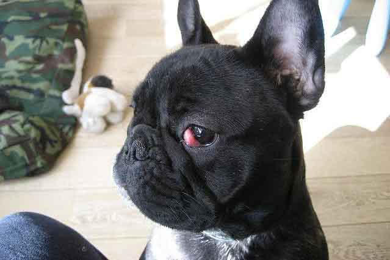
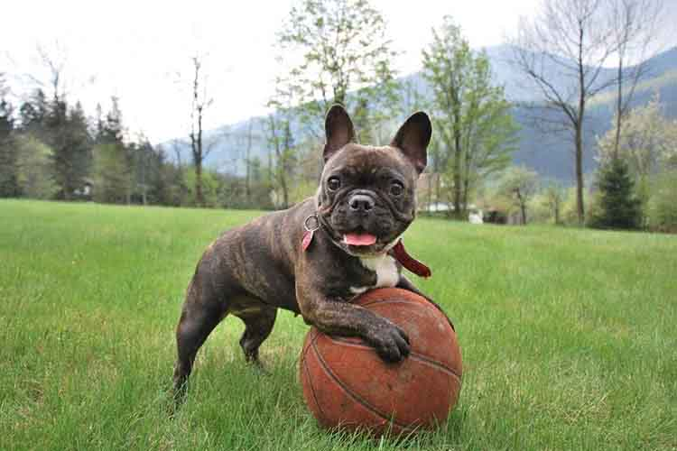
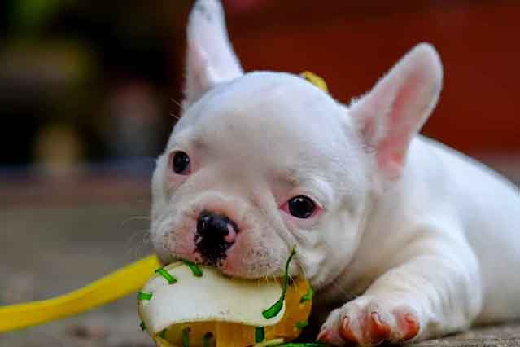

The French Bulldog has its name on the list of the most popular dog breeds across the US. But the interest of owning one Frenchies doesn’t come solely with the high initial cost whatsoever; the **French bulldog health risks** are going to add up the after-expenses.

According to researchers at The Royal Veterinary College (RVC), UK, Frenchies with their brachycephalic face, are vulnerable to spinal abnormalities, ear infections, diarrhea, and conjunctivitis.

Although the dogs are known to be the “healthiest” of all the “bully” breeds, treatments for any suffering can be costly.

That is why it always makes sense to get your Frenchies from [a reputable breeder](https://www.ethicalfrenchie.com "Reputable French Bulldog Breeder") and invest in pet insurance.

## Common French bulldog health risks

In recent years, the dramatic rise in popularity of the Frenchies is unprecedented. Dr. O’Neill from RVC worried that it was this high-demand was damaging to the French pups’ well-being.

Some breeders are only interested in making profit and don't follow the necessary steps to assure the mating will produce healthy puppies. Extensive genetic testing needs to be done on the Dam and Sire to confirm they are 100% healthy before taking the next step.

### Allergies

When the immune system encounters an alien substance that the body is not built to endure, it becomes a state of over-reactivity called allergies.

[French Bulldog Allergies ](https://barkingroyalty.com/french-bulldog-allergies/ "French Bulldog Allergies")can be a result of poor breeding, over-vaccination and improper care/diet. That said, your Frenchies may not be able to consume a certain type of food or intake drug.

Signs of allergies can take account in itchy and red skin, vomiting, diarrhea, inflamed throat, infected ears, paw chewing, and constant licking.

The causes could be anything like fleas, allergens in food, pollens, dander, or even your perfume. So, there is no better solution than visiting your vet when you are unsure of what is going on that makes your Frenchies suffering. Or, at least call and consult the doctor if the case is not severe.

Allergies are easy to control by feeding your French Bulldog a biologically appropriate diet - which is the raw diet. Feeding kibble, especially long term can result in digestion and skin issues and an overall shorter life span - but that applies to all the breeds, not just the bulldog. 

[**Click here to learn what food with recommend for French Bulldogs with allergies.**](https://ethicalfrenchie.com/blog/french-bulldog-care-13-best-dog-food-brands/ "French Bulldog Foods")

What other products do we recommend for a Frenchie struggling with allergies?

* [Colostrum](https://amzn.to/2PpeUQv)
* [Omega 3 Plankton](https://amzn.to/2Xvs1Eb)
* [Super Mushroom Immunity Powder](https://amzn.to/39YknY3)

### Brachycephalic Respiratory Syndrome

[Brachycephalic respiratory syndrom](https://vcahospitals.com/know-your-pet/brachycephalic-airway-syndrome-in-dogs "Brachycephalic respiratory syndrom"), one of the most common French bulldog health risks, refers to “a short head” or “flat face.” This means the dogs have to breathe through a short muzzle and compensate by respiring through the mouth.

“When it comes to exercise, rather than going for one long off-lead walk every day, it is safer to take three shorter off-lead walks as brachycephalic breeds tire easily and find it difficult to breathe due to their short muzzles. 

It is important that an owner understands the needs of their pet, monitors their breathing while exercising, and takes extra precautions to ensure they don’t overdo it.”

This is the major reason for Frenchies not to be resilient to many physical efforts. Although the dogs don’t seem uncomfortable with their endowed beauty, owners should not exhaust them with extreme exercises.

### Conjunctivitis (Pinkeye)

If you see your Frenchie’s eyes are getting abnormally red, it’s the sign of the inflammation of the tissues characterized in swollen and red eyelids.

The causes can be allergies or dry eyes. You can rub the eyes of the dog to comfort the irritation. If you visit the vet, you may have anti-inflammation medications to relieve part of the pain.

_What’s dangerous is  the consequence_

For bacterial infection, antibiotic medications may be prescribed. If the cause is  allergies, it is possible to apply the elimination diet which will rule out the possible causes/foods and cut back whatever is the culprit of the sickness.

### Cherry eye

Cherry eye is a disorder of the nictitating membrane (NM), also called the third eyelid, present in the eyes of dogs and cats.

Many times the condition doesn't present a serious health issue and can be fixed with a gentle massage. In extreme cases vet will recommend surgery to remove the tear gland. However, the postoperative result can develop dry eyes for the rest of the days.

But don’t leave this sickness untreated or it can seriously impair your Frenchie’s vision and grow into a horrible discomfort in the long run.

### Heat stress

Frenchies’ smushed faces, again, bring them one more common health issue prevailing in body temperature regulation.

The dogs usually struggle to cool themselves when the degree is up. This difficulty associated with the short face in which Frenchies can’t cool off efficiently, eventually leading to heat stroke. 

Avoid playing outside during the hot summer weather. I recommend skipping the dog park during the day and scheduling it either early morning or after 7 PM.

To know if your French pup is suffering the heat stress, notice if he is panting excessively, in convulsions or even vomiting.

In the presence of those uncomfortable symptoms, immediately move your dog to a cooler area or at least provide some shades. Gently massage the dog’s legs and cool him down with a old pad. It is possible to place him in a bathtub if there is any - lukewarm water not cold. 

### Hip dysplasia and other orthopedic conditions

The skeletal disorder results in the disposition of socket joints of the hip. It is the first form of hip arthritis and many chronic joint pains in the long run. It’s not hard to observe the irregularity like “bunny hopping,” hip sensitivity, inability to climb stairs, unwillingness to join activities, or difficulty in standing up.

Hip dysplasia occurs in rather bulky Frenchies than dogs with well-proportioned bodies. The causes for the disorder can be environmental, genetic or a combination of both. The disorder can also be potentially caused by an early spay, causing improper bone growth, which later one develops into hip dysplasia. 

Treatments for such ailment can be physical therapy and diet control. A healthy diet will surely minimize the chance of meeting this illness.

Otherwise, a hip dysplasia surgery for French bulldog can cost from $1,600 to $5,000. The operation procedures depend on the pooch’s age, namely:

· Juvenile Pubic Symphysiodesis (JPS): for pups if 10 and 18 weeks old

· Double or Triple Pelvic Osteotomy (DPO/TPO): dogs of less than 8-10 months of age

· Total Hip Replacement (THR): Frenchies of at least a year old

· Femoral Head Ostectomy (FHO): for any age

Reference:

[https://www.frenchiewiki.com/blog/health-problems/](https://www.frenchiewiki.com/blog/health-problems/ "https\://www.frenchiewiki.com/blog/health-problems/")

Other common skeletal conditions in bulldogs are also [patellar luxation](https://vet4bulldog.com/zen-bulldog-maintenance/orthopedics-neurology-in-bulldogs/medial-patella-luxation-in-bulldogs-and-french-bulldogs/) as well as [elbow dysplasia.  ](https://vet4bulldog.com/zen-bulldog-maintenance/orthopedics-neurology-in-bulldogs/elbow-dysplasia-in-bulldogs-and-french-bulldogs/)

### Spinal Abnormalities Leading Into Neurological Issues

1. Hemivertebrae

One of the potential spinal abnormalities in Bulldogs is Hemivertebrae, which  is a congenital (“at birth”, “born with”) malformation of the vertebrae seen most often in  short faced, screw tailed breeds like French, English, American Bulldogs and Pugs.

 The abnormality might be only detectable radiographically. Most are incidental findings on a radiograph and are not associated with clinical signs. But if clinical signs arise, it's usually due to spinal nerve compression and the dog will need further evaluation by a neurologist.

1. IVDD

Intervertebral disc disease (IVDD) is a condition where the cushioning discs between the vertebrae of the spinal column either bulge or burst (herniate) into the spinal cord space. These discs then press on the nerves running through the spinal cord causing pain, nerve damage, and even paralysis.

IVDD is a disease that effects the spinal cord over time, but it might not be apparent until there is a trigger. Unfortunately, a dog who appears to be completely healthy one day may take a fall or jump in such a way that a disc becomes ruptured. IVDD is a degenerative (gradual) process, but a jump or fall can damage a disc that has already been weakened by IVDD and bring on an acute phase of the disease. 

**Symptoms can range from mild to severe and can include:
**

•	Unwillingness to jump

•	Pain and weakness in rear legs 

•	Knuckling under

•	Paralysis 

•	Crying out in pain

•	Muscle spasms over back or neck

•	Hunched back or neck with tense muscles

•	Reduced appetite and activity level

•	Loss of bladder and/or bowel control 

### Deafness - Irresponsible Breeding Practices

The inability to hear can come from genetic defects. It also happens in senior dogs. People reckon extreme pied French Bulldogs, the dogs with genes associated with the lack of pigment cells, are the kind that is prone to this hearing loss.

It could be funny to think how the color affects the listening ability, but there are indeed little hairs called cilia that don't grow without the presence of pigment cells causing deafness in Frenchies. 

The high risk is present in dogs who are all white, or Pied French Bulldogs with little to no markings in the ear area.

A responsible breeder will make sure the Dam and Sire are a genetic match before mating them to avoid this from happening.

You can take your dog to a clinic and request a [BAER test](https://bluepearlvet.com/medical-articles/baer-test-for-hearing-loss/ "BEAR test for dogs") to diagnose the hearing ability for French pups as young as 6 weeks old.

## In Summary

Taking care of a brachycephalic pet is not a picnic work. It requires extreme care and love; on the other side is finance and patience to look after the **French Bulldog health risks**.

That said, please think responsibly before you want to adopt a French bulldog. Consider if you have enough time and money to give the dog a healthy yet fulfilled life.

Also, never think you can get a Frenchies under $500 or else it’s a scam. Remember that poor breeding is the primary trigger of many negatives that come after. So, don’t buy or encourage any cheap breeder even with exclusive deals. 

[**Click here to learn why French Bulldogs are expensive in the first place.**](https://ethicalfrenchie.com/blog/why-french-bulldogs-are-expensive-before-adoption/ "Why French Bulldogs are expensive")
