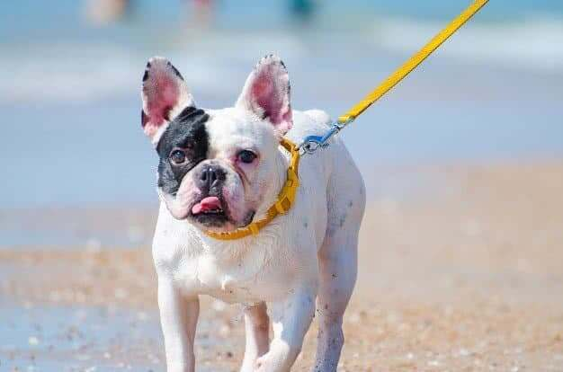

## French Bulldog Lifespan is generally between 10-14 years. Breed and genetics do play a role, but there are still many factors within your control. Make these small changes today to increase your French Bulldog's longevity.

### **1. Oral Care**

I can't emphasize this enough. Keep your Frenchies teeth clean. If you are feeding your dog the appropriate diet, which is the raw diet that consists of raw meaty bones, then teeth hygiene will not be a problem. BUT if you are feeding some other type of food, like kibble than daily or at least weekly brushing is a MUST.

**_Why is this important you ask?_**

Well,  dogs over the age of 3 have a 85% chance of getting some form of gum disease. Bacteria builds up over the years and can cause  gingivitis and other forms of disease in the oral cavity.

Harmful bacteria and toxins will enter the body via the bleeding gums and affect the vital organs, especially in older Frenchies.

Oral care alone can add up to 2 year to your [**French Bulldog's lifespan**.](https://ethicalfrenchie.com/blog/increase-french-bulldog-lifespan)

[**_If you aren't a fan of brushing, you can always use this water additive to support healthy gums._**](https://amzn.to/2DyWvhC)

### **2. Raw Food Diet**

Avoid commercial processed dog foods. Most  commercial dog foods ( kibble) are full of inferior sources of protein, also known as fillers. Inspect the ingredient list - if it contains a substantial amount of corn, wheat, soy or white rice, it's time to switch to a more canine appropriate food brand.

Actually, let's do a little test. Take your dog's food and soak it in a bowl of water. Let it sit for 15-20 minutes. If it blows up and becomes spongy - your basically feeding your dog a diet that consists of cereal and not meat.

I would recommend feeding you French Bulldog a Raw Food diet with a high quality proteinand bones as it's first ingredient. If you simply cannot stomach preparing raw food then commercial raw food is the way to go. Freshly cooked is OK, but keep in mind as soon as the protein is damaged by cooking, your dog doesn't benefit from it as much. And don't forget there is also the freeze dried raw option if handling raw meat goes against everything you stand for. 

If you're on a budget and can only afford to feed kibble, then add fresh ingredients to your dog's kibble. Even a small amount will make a huge difference.

**A few things you can add to your dogs kibble are:**

1.[Bone broth (you can make it at home as well)](https://amzn.to/3kdQ1FK)

[2. Probiotics and Enzymes ](https://amzn.to/2EJ0LLQ)

[3. Freeze dried food toppers](https://amzn.to/31nvoOA)

[4. Omega 3 Plankton ](https://amzn.to/2Xubvo2)

[5. Cold pressed hemp seed oil ](https://amzn.to/3gGRm5T)

6. Raw leafy greens


[**_Click here to check some of the dog foods we highly recommend._**](https://ethicalfrenchie.com/blog/french-bulldog-care-13-best-dog-food-brands/ "Best French Bulldog Foods")

### **3. Avoid Anything Containing Sunflower Oil and Corn**

Studies have shown that Sunflower oil increases cancer in dogs by 69%. Why do so many dog food brands still use it as an ingredient? Hmm..

We mentioned corn in the first paragraph of this blog. It's a well know allergen in dogs and just overall not a good ingredient, since is difficult to digest. 

Extra work involved in processing it can cause premature aging in so many dogs. Let's explain why. After ingesting corn (which is an inferior form of protein) the liver needs to work extra hard to get the usable protein out of it.

The breakdown of corn also produces a lot of nitrates, which put extra strain on the kidneys - since they have to filter out the toxins.

Starches aren't something dogs should be regularly eating, but unfortunately almost every kibble on the market contains just that. Which is why it's best to avoid kibble all together.

### **4. Joint Support**

Joints that are wasting away are very painful. Just like in humans the stress from chronic pain can also weaken the immune system, making your Frenchie susceptible to even more countless health problems.

It is generally agreed that French Bulldogs are more prone to hip dysplasia, but that does not mean it's a sentence to a shorter life span.

**_How to keep the joints healthy?_**

* Keep your doggo lean. Extra weight will put stress on the joints. Keep your Frenchie the leanest possible without it being visibly undernourished. Good muscle tone, ribs that are easily felt but not visible, no love handles...
* Feed raw meaty bones like chicken wings, turkey necks, chicken necks, chicken backs. All these bones are very healthy for your dog - in raw form and your pup will be able to crush and ingest the whole thing. RAW not cooked. Never give your dog a cooked bone. 
* Invest in a good joint supplement. Chances are your dog isn't getting the significant amount needed from the commercial food brand he's eating. If you were raw feeding your canine friend from the start, the chances of joint disease creeping up are lower. But if you haven't then I recommend using something like the [**Agility Formula by Life's Abundance**.](https://amzn.to/3i622uW)

### **5. Use Organic Household Products**

If the household product that we use daily for either cleaning the floors, kitchen surfaces, windows, all the air-fresheners, laundry detergents, etc, cause health issues for humans and have been a proven carcinogen, think about how that affects the smallest members of our family.

French Bulldogs love lounging around on the floors and are notorious for licking and chewing on stuff, which puts them directly at risk of ingesting the harmful ingredients.

Be mindful next time you're buying cleaning supplies. Keep things natural and organic.

We own multiple French Bulldogs, so there is always lots of cleaning to do, BUT the cleaning is always done with gentle pet friendly household products like:

* [ECOS Earth Friendly ALL PURPOSE cleaner](https://amzn.to/3kbOpvY)
* [Aunt Fannies Vinegar Wash Floor Cleaner Eucalyptus](https://amzn.to/2XJy88f)
* [Seventh Generation Concentrated Laundry Detergent](https://amzn.to/33qFoJD)

### **6. Regular Vet Check Ups**

Don't wait until it's too late. Find a trustworthy and honest vet that has your Frenchies best interest at heart. Do a yearly blood work panel to detect any abnormalities, especially in older dogs.

Keep your pooch up to date on shots, but don't over-vaccinate. Some vaccines like Lyme and Lepto, have been proven to cause allergic reactions and long-term issues with the bulldog breed, and should in my opinion be avoided, **unless strictly advised by your vet due to your highly-risky geographical location.**

### **7. Doggie Stairs**

French Bulldogs are prone to IVDD - Intervertebral disk disease (IVDD), often referred to as a slipped or herniated disk, refers to a syndrome of pain and neurological problems that accompany degeneration of one or more intervertebral disks. 

[**_Click here to learn more about IVDD in dogs and the most common symptoms._**](https://thepetwiki.com/wiki/intervertibral_disc_disease/ "IVDD in dogs")

You can prevent this from happening by simply training your Frenchie to use the doggie stairs instead of jumping on and off of high surfaces (beds, couches, stairs,...)

Too many young French Bulldogs end up paralyzed, or worse, euthanized due to the irreversible effects of IVDD. 

If you are a Frenchie owner - doggie stairs should be a must in your household.

* [Zinus Step Comfort Pet Stairs/Pet Ramp/Pet Ladder](https://amzn.to/2XqunV2)
* [Nova Microdermabrasion Pet Dog Stairs Steps for high Bed for Small Dogs](https://amzn.to/2XsllGW)

## Final Thoughts

Hopefully we provided some insight and useful information about how to increase **French Bulldog lifespan**. Our canine companions deserve nothing but the best when it comes to their care and well being.

Of course they won't be around forever, but with these easy tips, they can reach a higher life expectancy.
