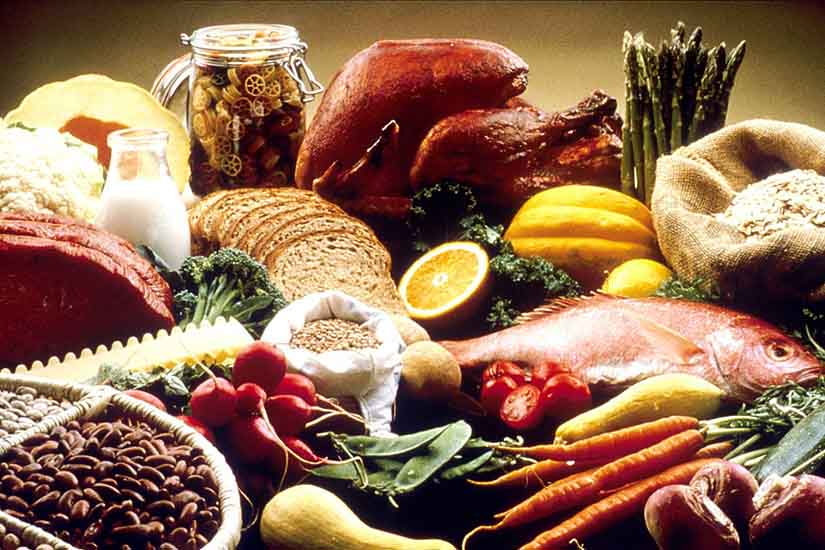
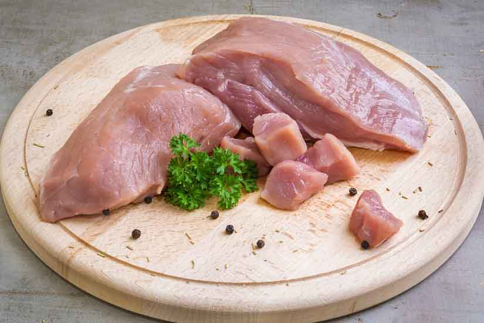
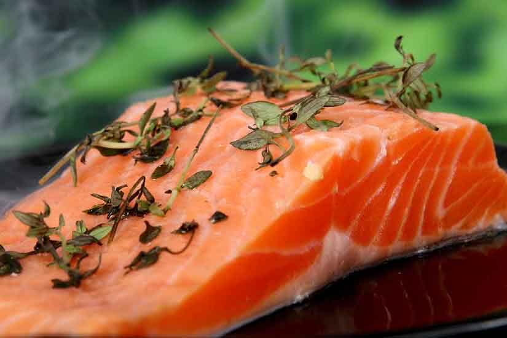

Frenchies are among the most favorite pets of worldwide households because of their lovable companionship. Therefore, no wonder you want to spare the best food for your furry friends.

However, not all brands of commercial dog food on the market are healthy enough for their digestive system. It depends on which ingredients are mixed. Understanding pet food labels is also an excellent way to take better care of your Frenchie.

So, let’s sort out the essential **nutrients for French bulldogs** you should always keep in mind.

## Vital nutrients for French Bulldogs

### Protein

Studies show that protein can bring about numerous benefits to bodies upon consumption. It supplies protein subunits or amino acids to build nails, skin, tendons, ligaments, muscles, and cartilage. Besides, protein is one of the essential substances for the production of hormones. Protein for Frenchies is rich in fish, poultry, meat, and some plant ingredients, including soybean 

_**How about protein in plants?**_

Soybean meal is known as a by-product created during the production of soybean oil. For that reason, not many labels welcome soy products.

Meat used in Frenchie food should be the clean flesh of slaughtered lamb, turkey, chicken, or cattle.

Sometimes, there are striated skeletal muscle, diaphragm, esophagus, tongue, and heart attached in that flesh. Hair, horns, hooves, teeth, and feathers will get completely removed so as not to mix with the fresh meat.

Though high protein dog food is necessary for your French pup, such diets would be detrimental to sick dogs’ health. In this case, make sure to go for low protein dog food to help relieve symptoms and push up the recovery process.



### Carbohydrates

Plants and grains are two primary sources that supply carbohydrates for your Frenchies.

Carbohydrates, known to provide bulk and energy, are in two categories, including fibers and starches, or sugars.

Fibers are products of fermentation that produce short-chain fatty acids thanks to bacteria in dog intestines. Large amounts of such acids can come from highly fermentable fiber sources like vegetable gums. While moderately fermentable fibers (available in beet pulp, etc.) supply both acids and bulk for moving waste via digestive tracts, slightly fermentable fibers mainly provide bulk and only a limited number of fatty acids.

Comprised starches are of many different types of sugar (including fructose and glucose), which can get easily converted into usable energy through dogs’ digestive mechanism.

### Vitamins and minerals

In the list of the **best nutrients for French bulldogs**, the enormous benefits of vitamins can be by no means neglected. They enhance blood clotting, bone growth, produce energy, and prevent oxidation. To facilitate the absorption of vitamin C into the body, water is required, whereas, vitamins A, D, E, and K ask for the provision of fat.

Minerals are helpful in muscle contractions and nerve transmissions besides providing support for the development of skeletons. Phosphorous, a vital mineral for senior dogs’ cellular repair and puppies’ growth, can be seen on many dog food labels.

### Fat

Fats are another necessary substance for dogs to take in through eating food. Once digested, they can provide bodies with necessary fat subunits, omega-3, and omega-6 fatty acids.

Numerous studies have indicated that omega-3 fatty acids play a crucial role in decreasing inflammation and blood clotting while omega-6 fatty acids serve to maintain proper membrane structure as well as enhance Frenchie’s coat and skin. Fats are the primary source of stored energy found in the body, which can provide a two-fold amount of energy compared to proteins or carbohydrates.

Fats are abundant in fish, poultry, meat and plant oils, namely flax and vegetable oils, so such kinds of food are in many vets’ recommendations for dog diets.

Click here to check out the[ Best Dog Food for French Bulldogs](https://ethicalfrenchie.com/blog/french-bulldog-care-13-best-dog-food-brands/ "Best Dog Food for French Bulldogs").

## 

## List of ingredients to avoid

Regarding the mass influx of dog food brands on the market, Frenchie owners may get confused as to which brand supplies healthy dog food for their little French fellow’s development.

Some pet food companies even exaggerate their products’ benefits to deceive consumers. Knowing unhealthy dog food ingredient lists can help you avoid choosing the unhealthy food type. Beside the **vital nutrients for French bulldogs**, what are the ingredients to avoid?

### BHA/BHT

They are chemical preservatives used to preserve fats in pet foods. Knowing for their link to causing child hyperactivity and cancer. Several countries have banned the use of this illness trigger in food.

### White flour

This simple carbohydrate is the leading cause of hunger soon after consumption in dogs due to spikes and drops in blood sugar. Consuming an excessive amount of white flour can increase the risks of dogs getting diagnosed with obesity or diabetes.

### Farmed salmon

Although salmon is healthy for your canines, the salmon that has not passed quarantine regulations might contain harmful toxins. A typical example is farmed-salmon, mentioned as salmon meals or salmon oil on food packages. It can increase the percentage of mercury and other fat-soluble toxins in your dog’ diet.

### MSG (monosodium glutamate)

Prepared foods often use MSG to enhance flavor, deceiving dogs’ taste in case low-quality ingredients cannot produce enough tasty flavor. MSG is not only useless in terms of nutrition but also a common allergen to diverse dog breeds.

Rather than seeing MSG written on labels, MSG is abundant in other ingredients such as hydrolyzed protein, texturized protein, yeast extracts, autolyzed yeast, sodium caseinate, disodium inosinate, and so on.

### Gluten

Contrary to human beings, many Frenchies develop [allergies](https://petlifebuzz.com/dog-allergies-faqs-and-food-recommendations/) to gluten-containing grains found in corn, wheat, or oats. Because of an overkill on grains, your companions may suffer from digestive distress, followed by chronic ear infections, hot spots or itching.

Acknowledging the good and the bad is never a waste. Understanding the harmful factors that take your fluffy companion’s health is worth every minute to spare. Get your furry fellow live a lifelong happily with you.

### Preservatives

Like other packaged food, chemicals are there to keep it fresh until use. Several common preservatives are tocopherols, rosemary, ascorbic acid, which are of natural origin to minimize chances of food spoilage.

However, manufacturers of canned dog food don’t use preservatives because the canning process has left out the need for chemical support.

### Artificial colors

Those are worthless processed type colors added to food to make it more visually attractive. They are found to cause biochemical processes within bodies besides hyperactivity.

### Chemical flavors

Fake taste and colors may trigger your [French bulldog](https://frenchbulldog.nyc/about-the-french-bulldog-breed/) to consume more food, but it leaves off the detrimental waste in the body in the long run. Those chemical uses are indigestible and likely to form stones in organs leading your Frenchies to sickness at their senior time. It is best to avoid such ingredients in any commercial food you buy for your little pup.

## Welcome a healthy Frenchie

Generally speaking, pet owners should conduct comprehensive research on all dog food brands to pick out the best dog food suited for their pets’ health condition. Refer to the list mentioned above of common ingredients as well as harmful ones, or consult a veterinarian if necessary, and you can make informed decisions in the interests of your lovely friends.

Interested in making your own food? Click here for [French Bulldog Food Recipes](https://ethicalfrenchie.com/home-cooked-food-for-your-french-bulldog-ethical-frenchie/ "French Bulldog Food Recipes").
