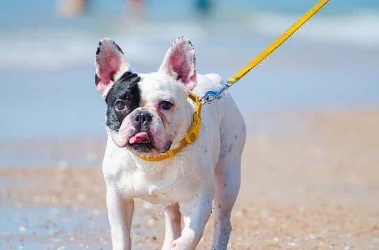

**Traits of a French bulldog?**

[Frenchies ](https://en.wikipedia.org/wiki/French_Bulldog#Temperament "French Bulldog Temperament ")are a great even-tempered house dog. They are particularly popular with urban citizens who live in limited-space apartments.

People love the fact that Frenchies are small-built dogs, and they don’t shed much. More than that, they come in a variety of different colors; they chill, bark, make you laugh,  
and many more wonderful traits only left to you, the owner to discover.

So, what are the **traits of a French bulldog** that give them a huge fan club across the country? Find all out right below.

## 10 Traits of a French Bulldog

### Physical Traits of a French Bulldog

#### Bat Ears

The trademark erecting **bat dog** ears are highlights that hard to ignore when looking at a Frenchie. These ears don’t come all the way up when your Frenchie is at his first phase of life. 

The pointing process grows with your dog’s development. On a normal growth, you should see the ears start an upward trend around seven weeks.

But the odd may occur when you don’t see any sign of the ears standing up. This is when human interference will help. The owners can tape each ear up and keep it flat to avoid a crinkled base. Then, navigate the ears to the right position and leave them there for 4 to 5 days and gently peel off to remove.

#### Brahycephalic Face

Frenchies are as well famous for their unique appearance resembles a bulldog in miniature. Their faces feature heavy wrinkles rounding the bug-eyes and narrow nostrils. 

This [brachycephalic](https://www.hillspet.com/dog-care/behavior-appearance/brachycephalic-dogs "Brachycephalic french bulldog face") face shape gives the dogs the exclusive yet amusing look with which their personality comes along.

However, the short-nose resulted by the awkward shape takes away the ability to breath properly, thus making Frenchies belong to non-sporting dog group.

That said, city folks who love occasional short walks will find French bulldogs great companions.

#### Medium Built

A mature Frenchie can weigh up to 28 pounds; females are smaller. We consider them great apartment dogs with little to worry about them sharing your living space.

Although small, Frenchies are muscular dogs if they are on a sufficient diet, which explains why they are heavy on the hands.

[**Click here to read more about the appropriate diet fro your French Bulldog.**]()

#### Thin Coat

Frenchies are not furry in spite of a thin layer of hair. This could be a plus to those who are allergic to dog fur and not prone to cleaning hairballs under the couch. 

But don’t laugh yet! The dogs shed though, only a little. If you keep a regular bathing routine and grooming your Frenchie well, the shiny and silky coat will be a reward.

#### Little Tail

Do Frenchies have tails? They do, but it’s docked exposing their butts on the show. It could be a minor for many dogs but not a serious concern for French bulldogs.

The selective breeding from ages has given the breed this tail form for some reasons; not all of them are bad. No tail means more speed and no attack to this weak point. 

Interestingly, this corkscrew tail further adds a cosmetic appeal to the breed. However, there are exceptions. Some French Bulldog do posses a small tail, but it rarely happens. 

So, does it mean no wagging tail? Hmm, yes. But you have a better make-up, a loyal unique canine fellow.

#### Short Legs

The low-profile plus stumpy legs don’t make Frenchies a racer although they may have all the willing playfulness. When standing up on four legs, Frenchies only reach around 1 foot tall. In addition to that, the height is not significant when they stand on their back legs.

And you know the obstructed airway through their narrowed nostrils doesn’t allow beyond-the-line exercise.

#### Coat Colors

Among the traits of a French bulldog, color is a prominent one.

You can find French bulldogs of many colors. The standards are fawn, cream, and black, with many shades of brindles. It’s rare to see a Frenchie with a solid color coating the entire body. There should be specks and streaks of light and dark patterns. Some dogs even wear a different pigmentation on the nose, ears, and places along the body.

Exceptionally, blue French bulldogs are rare among the colors for the uncommon recessive gene diluted, causing the blueish hair to grow irregularly. Other rare colors are Lilac, Chocolate, Platinum, Merle, etc..

[**Click here to learn about all the French Bulldog colors.**](https://ethicalfrenchie.com/blog/french-bulldog-colors-explained/ "French Bulldog Colors")

### Social Traits of Frenchies

#### Teritorial Breed

Frenchies love their humans, but not the people and animals around that human. They may act as they suspect you are sharing the love with someone or other pets. But it’s not hard to get your dog introduced to the household members and children. Other dogs and cats may take time but not impossible.

But after all, French Bulldogs are incredibly friendly to kids and affectionate to all households. 

#### Attentiveness

Regarding the high demand for possession, Frenchies like to keep your company at all time. They need you to cuddle, pet and pay attention to them everywhere. So, it’s likely to see your French pup following you from room to room.

Another mean of your attention is Frenchies can’t help themselves in some particular troubles like falling into the water to struggling to breathe. That said, you don’t let your dog roam around the neighborhood when you are not there to watch. The dog is not suitable for a home-away worker, too.

Consider this French trait when you decide to adopt one.

#### Inteligence

People don’t rate 5 stars for the smartness of French bullpups but that doesn’t imply any dumbness. 

The dogs are trainable to cues and a few intricate orders. However, they are also famous for being stubborn. That is why you will need extra patience and consistency when teaching **Frenchies**.

#### Bonus: Frenchie Snort

Suffering from the brachycephalic syndrome, the dogs commonly snort after a time playing and running. That should explain why French bulldogs are restful dogs during the day.

You may also hear your pup snuffle in his sleep due to this collapse of the airway.

So, again, don’t give your Frenchies too much exercise and don’t get them hyperkinetic in any play.

## What's more?

Every dog has his greatest to grow while living with a loving owner. So, be that perfect owner and give your Frenchie the still life he deserves.

Having a Frenchie following you around only promises to make your day. The breed doesn’t demand much except for your affection and proper care that will prolong his life up to 12 years. Spending time with this breed, you will discover more than 10 **traits of a French bulldog** mentioned above.

In the end, we’d like to address that a French bulldog is not a budget dog. To ensure welcoming a healthy bull pup to your home, please seek a reputable breeder with years of experience.

[**Click here to read more about why French Bulldogs come with a high price tag.**](https://ethicalfrenchie.com/blog/why-french-bulldogs-are-expensive-before-adoption/ "French Bulldog High price tag")

Reference:

[https://dogtime.com/dog-breeds/french-bulldog#/slide/1](https://dogtime.com/dog-breeds/french-bulldog#/slide/1 "https://dogtime.com/dog-breeds/french-bulldog#/slide/1")
